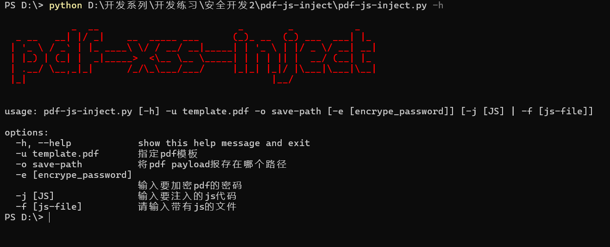
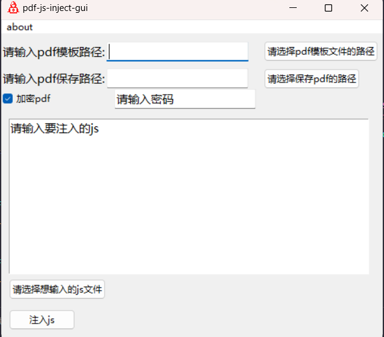
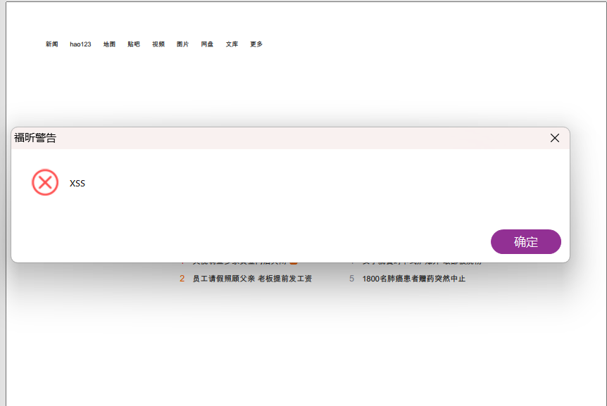

# pdf-js-inject

pdf-js-inject，能够将js代码注入到pdf文件中,也可以注入xss-payload到pdf文件中。

## 下载

```md

git clone https://github.com/youmulijiang/pdf-js-inject

cd pdf-js-inject

pip install requirements.txt

python pdf-js-inject.py

```

## 使用截图



## 作者

作者是一个普通的安全开发成员，如果这个项目对你有帮助的话，请点击右上角的⭐

梨酱最喜欢⭐⭐啦  ヾ(≧▽≦*)o*
